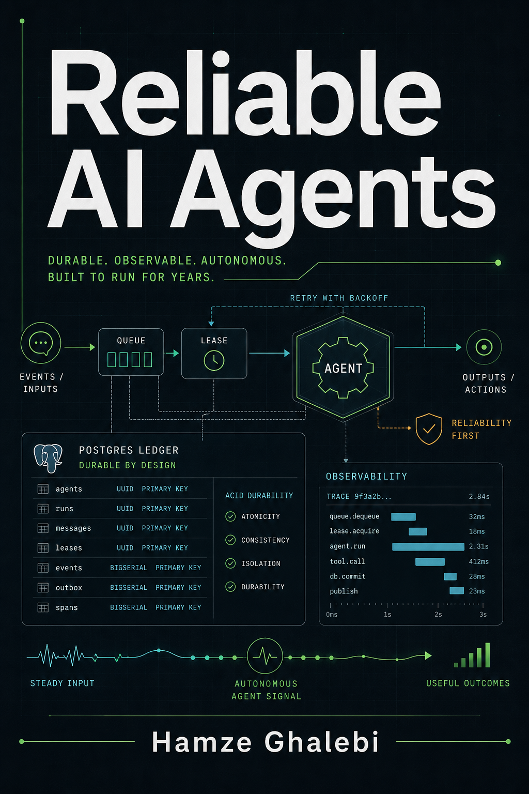

# Reliable AI Agents



**Author:** Hamze Ghalebi

**Subtitle:** Rust, Rig, Postgres, and the engineering of AI agents that keep
working.

> **Draft status:** This book is an active draft. I am continuing to test the
> examples, sharpen the production guidance, and improve the learning path.
> Feedback, corrections, and reports from real production experience are
> welcome.

> **License:** Individual learning is allowed. Non-commercial and nonprofit
> reuse of limited portions is allowed with clear citation to the book title,
> author, source page, and relevant sources. Commercial reproduction,
> consulting use, client delivery, paid training, company team training,
> internal business enablement, model training, retrieval systems, or any use
> inside a business pipeline requires a separate written license from Hamze
> Ghalebi. The examples are teaching artifacts, not a substitute for testing
> your own system.

## What This Book Is

Reliable AI Agents is a production engineering book for builders who want agent
systems that can run for months or years without depending on luck.

The book starts from one durable loop:

```text
enqueue -> lease -> run agent -> record evidence -> retry or finish
```

Then it turns that loop into an operating system for agents:

```text
typed domain model
Postgres job ledger
Rig provider boundary
idempotency and side-effect receipts
evaluation gates
human approval
runbooks
SLOs
security controls
disaster recovery
release discipline
```

## Who It Is For

This book is for AI engineers, Rust engineers, platform engineers, and founders
who have already seen a one-off agent run succeed and then asked what would
make the same work safe for production.

You do not need a large platform team to use the ideas here. You do need to care
about state, failure, evidence, and operator control.

## The Standard

The standard of this book is not "the agent ran once."

The standard is:

```text
The system explains what happened.
The system can retry safely.
The system can stop safely.
The system can be audited later.
The system can be improved without losing old work.
```
